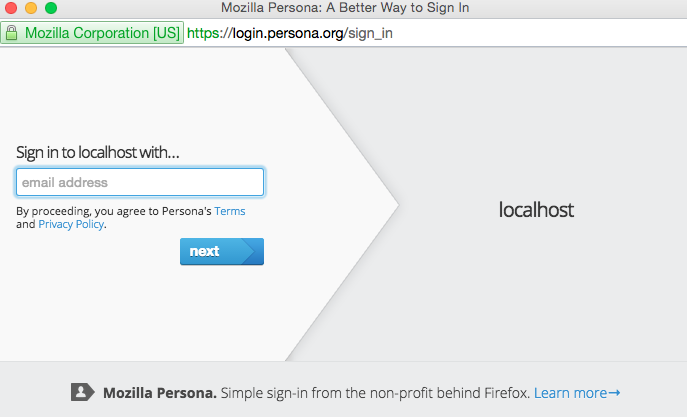

# Item Catalog

Project 3 for Full-Stack Nanodegree

The item catalog uses Mozilla Persona for authentication and authorization.

Any email account that can receive an email can be used with this service.

BEFORE the first run, make sure to populate the database by running `python initalize_db.py`.
MongoDB is already installed in the Vagrant image, start it by executing `sudo mongod &`
That tells the MongoDB Server to run until explicitly stopped.

And starting the server by executing `python /vagrant/catalog/application.py`

 - Hit the login button and go through the flow.

 - Input your email address into the Mozilla Persona pop up and select a password. If you have a Gmail account, Persona might handle both sides of the flow for you. If not, you will have to confirm ownership of your email account by clicking a link

- After clicking the link, you will be redirected and logged in. Future logins from the same browser will not require your password.

